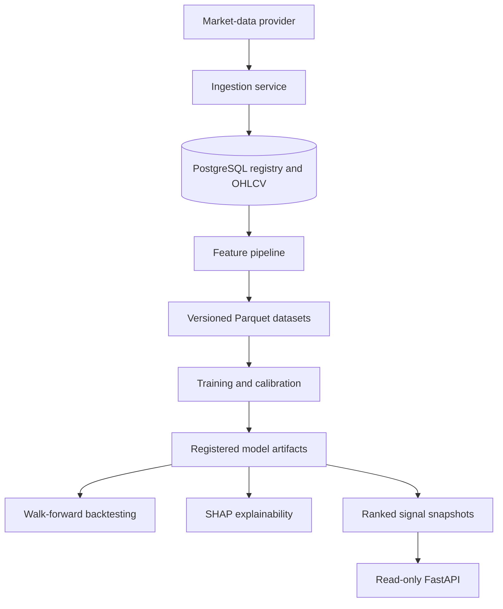

# Quant Signal Workstation & Forecasting Pipeline

[](https://github.com/co-rtex/Quant-Signal-Workstation-Forecasting-Pipeline/actions/workflows/ci.yml?query=branch%3Amain)
[](LICENSE)

**An end-to-end research platform for reproducible equity-signal generation: market-data ingestion, versioned feature datasets, calibrated multi-horizon models, walk-forward backtests, SHAP explanations, and read-only signal APIs.**

> **Status:** the MVP workflow is implemented and tested locally and in integration tests. The next work is operator experience and deployment/readiness hardening. This is a research system, not investment advice or a live trading service.

## Why It Exists

A model notebook can produce a prediction without making the result reproducible or auditable. This project treats forecasting as a data and systems problem: every downstream run is tied to persisted market data, an explicit dataset version, a registered model version, and recorded execution assumptions.

The goal is to make leakage controls, artifact lineage, costs, model selection, and explainability visible throughout the workflow.

## Key Features

- Replaceable market-data provider contract with classified transient/permanent failures
- PostgreSQL registry for ingestion runs, normalized OHLCV bars, datasets, models, evaluations, backtests, explanations, and signal snapshots
- Versioned Parquet feature datasets with artifact hashes and metadata
- Leakage-aware temporal splits and multi-horizon labels for 1D, 5D, and 20D targets
- Calibrated logistic-regression and histogram-gradient-boosting candidates
- Champion selection using PR-AUC, Brier score, and ROC-AUC
- Monthly walk-forward backtests with transaction costs, slippage, turnover, benchmark-relative analytics, and regime slices
- Global and local SHAP artifacts tied to concrete model versions
- Idempotent ranked-signal publication and read-only FastAPI endpoints
- Scheduler-friendly CLI commands with machine-readable success and error output

## Architecture



PostgreSQL stores normalized data and metadata lineage; Parquet and serialized bundles store versioned data/model artifacts. The API reads persisted model metadata and signal snapshots rather than training inside request handlers.

See [Architecture](ARCHITECTURE.md) for component boundaries, persistence choices, and tradeoffs.

## Technical Highlights

| Area | Implementation |
| --- | --- |
| Reproducibility | Explicit dataset/model IDs, artifact hashes, persisted assumptions, and versioned Parquet |
| Data engineering | Normalized OHLCV ingestion, provider diagnostics, retry metadata, and Alembic migrations |
| ML evaluation | Time-aware splits, probability calibration, multi-metric champion selection |
| Backtesting | Monthly walk-forward retraining, overlapping horizon sleeves, costs, slippage, and turnover |
| Explainability | Global and per-signal SHAP outputs tied to a registered model and evaluation window |
| Serving | Read-only FastAPI endpoints backed by persisted snapshots |
| Interfaces | Thin CLI commands over service-layer contracts with JSON output |
| Quality | Strict mypy, Ruff, unit tests, PostgreSQL-backed integration tests, and CI |

## Tech Stack

- **Language:** Python 3.14
- **API:** FastAPI and Pydantic
- **Database:** PostgreSQL, SQLAlchemy, Alembic, and Psycopg
- **Data:** pandas, NumPy, PyArrow/Parquet
- **Modeling:** scikit-learn and SHAP
- **Development provider:** yfinance behind a provider interface
- **Tooling:** Hatchling, Ruff, mypy, pytest, Docker Compose, and GitHub Actions

## Getting Started

```bash
python3 -m venv .venv
source .venv/bin/activate
python -m pip install --upgrade pip
python -m pip install -e '.[dev]'

cp .env.example .env
docker compose up -d postgres
make migrate
```

Start the read-only API:

```bash
make run-api
```

## Example Pipeline

Each stage requires an explicit upstream version instead of silently selecting the latest artifact.

```bash
# 1. Ingest daily market data
quant-signal-pipeline ingest \
  --start-date 2024-01-02 \
  --end-date 2024-05-31 \
  --symbols AAPL

# 2. Materialize a versioned feature dataset
quant-signal-pipeline build-dataset \
  --as-of-date 2024-05-31 \
  --symbols AAPL

# 3. Train calibrated candidates from the returned dataset version
quant-signal-pipeline train \
  --dataset-version-id <dataset-version-id> \
  --horizon 1 \
  --horizon 5

# 4. Backtest an explicit model version with recorded costs
quant-signal-pipeline backtest \
  --model-version-id <model-version-id> \
  --top-n 1 \
  --transaction-cost-bps 5 \
  --slippage-bps 2

# 5. Generate explanations and publish persisted signal snapshots
quant-signal-pipeline explain \
  --model-version-id <model-version-id> \
  --sample-size 8 \
  --top-signals 3

quant-signal-pipeline publish-signals \
  --model-version-id <model-version-id>
```

Successful commands print compact JSON summaries containing the persisted run IDs and artifact references. Failure paths emit machine-readable error payloads.

## Testing

```bash
make lint
make typecheck
make test
make validate
```

The test suite covers:

- provider envelopes, failure classification, and deterministic retry behavior
- temporal features, labels, splits, and dataset materialization
- model training, calibration, persistence, and signal serving
- cost-aware walk-forward backtesting, turnover, attribution, and regime summaries
- SHAP artifact generation
- CLI success, validation, and unknown-version failure paths
- PostgreSQL migrations and API readiness behavior

## Project Status

| Implemented | Next |
| --- | --- |
| Ingestion provider abstraction and normalized OHLCV persistence | Operator-facing workflow improvements |
| Versioned feature datasets and registry lineage | Thin task-runner/deployment wrappers |
| Calibrated model training and champion selection | Deployment and readiness hardening |
| Cost-aware walk-forward backtests | Production data-provider decision |
| SHAP explainability artifacts | Broader model and strategy comparisons |
| Persisted signal snapshots and read-only API | Production scheduling target |

The running delivery record is in [CHANGELOG.md](CHANGELOG.md), and [EXECUTION_PLAN.md](EXECUTION_PLAN.md) tracks completed and next phases.

## Repository Layout

```text
.
├── alembic/                  # Database migrations
├── src/quant_signal/         # Application package
├── tests/                    # Unit and PostgreSQL-backed integration tests
├── ARCHITECTURE.md           # System design and tradeoffs
├── CHANGELOG.md              # Delivery record
├── EXECUTION_PLAN.md         # Phase status and remaining work
├── Makefile                  # Local validation and run commands
├── docker-compose.yml        # Local PostgreSQL
└── pyproject.toml            # Package, dependency, lint, type, and test config
```

## Important Boundaries

- The default provider is appropriate for development, not a production market-data SLA.
- Backtests are research artifacts and do not represent live performance.
- Cost and slippage assumptions are explicit inputs and default to zero unless configured.
- The API serves persisted results; it does not train models on request.
- No investment or performance claim is made by this repository.

## License

[MIT](LICENSE)
